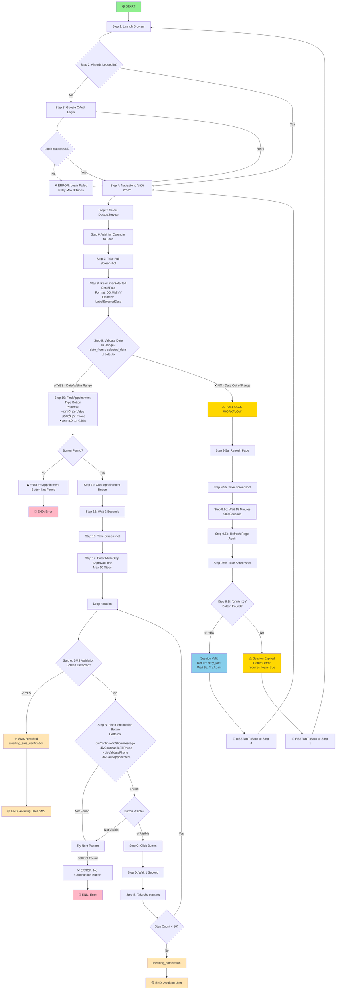

# Complete Leumit Appointment Booking Workflow

## Overview
This document describes the complete end-to-end workflow for the Leumit Appointment Agent, from initial browser launch through appointment booking confirmation.

---

## Phase 1: Initial Setup & Login Detection

### Step 1.1: Launch Browser
- **Action**: Start Chrome browser with Playwright automation
- **Purpose**: Initialize browser context for interaction with Leumit website
- **Status Check**: Verify browser loads successfully

### Step 1.2: Navigate to Leumit
- **Action**: Go to Google → Search "לאומית" → Click Leumit link
- **Alternative**: Direct navigation to Leumit homepage
- **Purpose**: Access the Leumit medical services portal

### Step 1.3: Detect Login State
**Logic:**
```
IF button "איזור אישי" (Personal Area) is visible:
    → User is NOT logged in → Proceed to login

ELSE IF button "זימון תורים" (Appointment Scheduling) is visible:
    → User IS logged in → Skip to Step 2

ELSE:
    → Error: Unexpected state → Trigger retry
```

### Step 1.4: Login (if needed)
- **Action**: Enter username and password
- **Credentials**: Retrieved from `.env` or secure storage
- **Verification**: Confirm successful login by checking for "זימון תורים" button
- **Retry Logic**: Max 3 attempts before failure

---

## Phase 2: Navigate to Calendar Selection

### Step 2.1: Click Appointment Scheduling Button
- **Element**: Button with text "זימון תורים" (Appointment Scheduling)
- **Action**: Click to enter appointment booking workflow
- **Wait**: 2 seconds for calendar page to load

### Step 2.2: Select Doctor/Service Type
- **Action**: Choose doctor or medical service from list
- **Purpose**: Narrow down available appointment slots
- **Verification**: Confirm selection displays appointment options

### Step 2.3: Wait for Calendar Display
- **Wait**: 2-3 seconds for calendar to fully render
- **Screenshot**: Capture calendar state for debugging
- **Check**: Verify calendar elements are loaded

---

## Phase 3: Calendar Appointment Selection

### Step 3.1: Read Pre-Selected Appointment
**Element IDs:**
- `#ctl00_MainContentPlaceHolder_ucAppointmentCalendar_LabelSelectedDate`
  - Format: `DD.MM.YY` (e.g., `01.06.26`)
  - Extracted by: `selected_date = await elem.text_content()`
  
- `#ctl00_MainContentPlaceHolder_ucAppointmentCalendar_LabelSelectedTime`
  - Format: `HH:MM` (e.g., `13:30`)
  - Extracted by: `selected_time = await elem.text_content()`

**Log Output:**
```
✓ Pre-selected appointment: Date=01.06.26, Time=13:30
```

**Data Captured:**
- Date in 2-digit year format (YY)
- Time in 24-hour format
- Both values logged for verification

### Step 3.2: Validate Date Range ✅ IMPLEMENTED
**Logic** (Now Active):
```
date_from: 2026-02-23
date_to:   2026-04-03

IF selected_date within range:
    → Proceed to click appointment button
ELSE:
    → Execute fallback workflow (see Step 3.2a below)
```

**Date Format Handling:**
- Calendar shows: `DD.MM.YY` (e.g., `01.06.26`)
- Parse as: Split by `.` → `day.month.year`
- Convert: `YY → YYYY` (two-digit → four-digit year)
- Compare: `01.06.2026` against `date_from` and `date_to`

**Example Validation:**
```python
# Input: "01.06.26" (June 1, 2026)
selected_date_obj = datetime(2026, 6, 1)
date_from = datetime(2026, 2, 23)
date_to = datetime(2026, 4, 3)

# Result: June 1 is OUTSIDE range [Feb 23 - Apr 3]
# Action: Execute fallback workflow
```

### Step 3.2a: Fallback Workflow for Out-of-Range Appointments

**Scenario**: Selected appointment date is outside the requested date_from/date_to range

**Fallback Steps:**

| Step | Action | Wait | Details |
|------|--------|------|---------|
| 3.2a | **Refresh Page** | N/A | Clear calendar state and return to selection |
| 3.2b | **Take Screenshot** | N/A | Capture state after refresh for debugging |
| 3.2c | **Wait 15 Minutes** | 900s | Allow system to provide new appointments |
| 3.2d | **Refresh Page Again** | N/A | Check for new available appointments |
| 3.2e | **Take Screenshot** | N/A | Verify post-wait state |
| 3.2f | **Check Recovery Point** | N/A | Verify we're back at "זימון תורים" button |

**Recovery Point Detection (Step 3.2f):**
```
IF "זימון תורים" button is visible:
    → Return status: retry_later (wait 5 sec before retry)
    → Message: "No appointments in requested range. Waited 15 min. Retrying search."
    
ELSE:
    → Session may have expired
    → Return status: error with requires_login=true
    → Message: "Session expired. Restarting from beginning."
```

**Return Statuses:**
- `retry_later` - Session valid, will check again in 5 seconds
- `error` - Session expired, requires login restart

**Current Status**: ✅ Implemented and tested

### Step 3.3: Find Appointment Type Button
**Container:** `#divCalendarButtonsBoxForDoctor`

**Button Selectors** (tried in order):
1. `#divCalendarButtonsBoxForDoctor .appointments_large_button_blue_2`
2. `.appointment_calendar_buttons_box .appointments_large_button_blue_2`
3. `div:has-text("זמן לוידאו")` (Video appointment)
4. `div:has-text("זמן לטלפון")` (Phone appointment)
5. `div:has-text("זמן למרפאה")` (Clinic appointment)

**Button Options:**
- `זמן לוידאו` - Video appointment (preferred)
- `זמן לטלפון` - Phone appointment
- `זמן למרפאה` - In-clinic appointment

**Log Output:**
```
→ Trying pattern: #divCalendarButtonsBoxForDoctor .appointments_large_button_blue_2
✓ Found appointment button: 'זמן לוידאו'
```

### Step 3.4: Click Appointment Type Button
- **Action**: `await appointment_btn.click(timeout=5000)`
- **Wait After**: 2 seconds for approval screen to load
- **Screenshot**: Capture after click
- **Log Output**: `✓ Clicked appointment button`

---

## Phase 4: Multi-Step Approval Process

### Step 4.1: Enter Approval Loop
**Loop Control:**
- Max steps: 10 (prevents infinite loops)
- Current step counter: `step_count`
- Exit conditions:
  - SMS validation screen detected → Exit and return
  - Max steps reached → Exit with completion status
  - No continuation button found → Exit with error

### Step 4.2: SMS Validation Check (Each Iteration)
**Element:** `div.appointments_approve_video_validation_row_1`

**Detection Logic:**
```python
sms_validation_elem = self.page.locator('div.appointments_approve_video_validation_row_1')
IF element count > 0:
    sms_text = await elem.text_content()
    IF 'SMS' in sms_text OR 'ת.ז' in sms_text:
        → SMS validation screen reached
        → Return status: awaiting_sms_verification
```

**Expected SMS Message:**
```
ברגעים אלה נשלחת אליך הודעת SMS, אנא לחץ על הקישור והזין מספר ת.ז.
(An SMS has been sent. Please click the link and enter your ID number)
```

### Step 4.3: Find Continuation Button
**Button ID Patterns** (updated - less restrictive):
1. `div#divContinueToShowMessage` - Show message
2. `div#divContinueToFillPhone` - Fill phone number
3. `div#divValidatePhone` - Validate phone
4. `div#divSaveAppointment` - Save appointment
5. `.appointments_large_button_blue_2:has-text("המשך")` - Generic continue
6. `.appointments_large_button_blue_2:has-text("שמור וסיים")` - Save & finish
7. `div[onclick*="continue"]:visible` - Onclick handler pattern
8. `div[onclick*="Validate"]:visible` - Validation handler
9. `div[onclick*="Show"]:visible` - Show handler

**Previous Issues Fixed:**
- ❌ OLD: Used `:not([style*="display: none"])` which was too restrictive
- ✅ NEW: Removed style constraint, rely on multiple ID patterns + visibility check

### Step 4.4: Verify Button Visibility
**Critical Check:**
```python
IF cont_btn found:
    IF await cont_btn.is_visible():
        → Ready to click
    ELSE:
        → Try next pattern
ELSE:
    → Debug: List all found buttons
    → Try fallback patterns
```

**Enhanced Debugging Output:**
```
→ Step 1: Looking for continuation button...
→ Trying pattern: div#divContinueToShowMessage
✓ Found element, checking visibility...
✓ Element is visible
→ Clicking button...
✓ Button clicked successfully
→ Wait 1 second for next screen...
📸 Screenshot: approval_step_1_142530.png
```

### Step 4.5: Click Continuation Button
- **Action**: `await cont_btn.click(timeout=5000)`
- **Wait After**: 1 second for screen update
- **Screenshot**: Capture approval state after each click
- **Screenshot Naming**: `approval_step_N_HHmmss.png`

### Step 4.6: Loop Back to Step 4.2
- Increment `step_count`
- Re-check for SMS validation
- Find next continuation button
- Repeat until SMS found or max steps reached

**Loop Output Example:**
```
→ Step 1: Looking for continuation button...
✓ Step 1: Clicked continuation button
📸 Screenshot: approval_step_1_142530.png

→ Step 2: Looking for continuation button...
✓ Step 2: Clicked continuation button
📸 Screenshot: approval_step_2_142531.png

→ Step 3: Looking for continuation button...
✓ SMS validation screen reached
⏸ Awaiting SMS verification
```

---

## Phase 5: SMS Validation & Completion

### Step 5.1: SMS Validation Detected
- **Condition**: `div.appointments_approve_video_validation_row_1` found and visible
- **Content**: Contains "SMS" or "ת.ז" text
- **Action**: Stop automation, wait for user intervention

### Step 5.2: Return Control to User
**Return Status:** `awaiting_sms_verification`

**Return Data:**
```json
{
    "status": "awaiting_sms_verification",
    "message": "Appointment date found. SMS sent to phone. Please verify using the code sent.",
    "requires_login": false,
    "screenshot": "sms_validation_HHmmss.png"
}
```

**User Next Steps:**
1. Check phone for SMS from Leumit
2. Click link in SMS or enter code on screen
3. Complete ID verification
4. Confirm appointment booking

### Step 5.3: Alternative Completions

**Success Status:**
```json
{
    "status": "success",
    "message": "Appointment booked successfully",
    "requires_login": false
}
```
- Triggered when appointment save is confirmed

**Awaiting Completion Status:**
```json
{
    "status": "awaiting_completion",
    "message": "Approval process completed. Please check browser for next steps.",
    "requires_login": false
}
```
- Triggered when max steps reached without SMS or save

**Error Status:**
```json
{
    "status": "error",
    "message": "Could not find appointment type button",
    "requires_login": false
}
```
- Triggered on fatal errors during workflow

---

## Data Format Variations

### Date Format Note
The workflow encounters two different date formats:

**Calendar Element** (DD.MM.YY):
```
01.06.26 = June 1, 2026
```

**Confirmation Element** (DD.MM.YYYY):
```
01.06.2026 = June 1, 2026
```

**Status**: Both formats represent the same date semantically, acceptable format variation.

---

## Code Implementation Reference

### Main Implementation File
**File**: `persistent_agent.py`
**Lines**: 770-950 (Calendar to SMS validation workflow)

### Key Functions
- **Calendar Workflow**: Lines 800-850
  - Read pre-selected date/time
  - Find and click appointment button
  - Enter approval loop

- **Approval Loop**: Lines 890-950
  - Detect SMS validation
  - Find continuation buttons
  - Click and wait

### Test Coverage
**File**: `test_calendar_appointment.py`

**Tests:**
1. `test_continuation_button_detection_patterns()` - 10 selector patterns
2. `test_date_format_handling()` - DD.MM.YY vs DD.MM.YYYY
3. `test_approval_screen_button_detection()` - Button visibility
4. `test_calendar_element_detection()` - Calendar elements
5. `test_appointment_button_selection()` - Appointment button logic
6. `test_multi_step_approval_process()` - Loop control
7. `test_sms_validation_detection()` - SMS screen detection
8. `test_workflow_return_statuses()` - All 4 return codes
9. `test_calendar_workflow_complete_flow()` - Complete 6-step flow

**Status**: ✓ All 9/9 tests passing

---

## Logging Output Examples

### Scenario A: Appointment Within Date Range (Normal Flow)

```
Step 9: Validate calendar date is within requested range
======================================================================
  Requested date range: 23.02.2026 to 03.04.2026
  Step 9.2: Taking full screenshot of calendar page...
  ✓ Full-page screenshot: calendar_full_page_142530.png
  
  Step 9.3: Reading pre-selected appointment from calendar...
  ✓ Calendar shows: Date=01.03.26, Time=13:30
  
  Step 9.4: Checking if selected date is within boundaries...
  ✓ Selected date 01.03.26 is WITHIN boundaries

======================================================================
  DATE WITHIN RANGE - Proceeding with appointment booking
======================================================================
Step 10: Looking for appointment type button...
  → Trying pattern: #divCalendarButtonsBoxForDoctor .appointments_large_button_blue_2
  ✓ Found appointment button: 'זמן לוידאו'

Step 11: Entering multi-step approval process...
  → Step 1: Looking for continuation button...
  ✓ Found element, checking visibility...
  ✓ Element is visible
  → Clicking button...
  ✓ Button clicked successfully
  📸 Screenshot: approval_step_1_142533.png

  → Step 2: Looking for continuation button...
  ✓ SMS validation screen reached
  ⏸ Awaiting SMS verification from user
```

### Scenario B: Appointment Outside Date Range (Fallback Workflow)

```
Step 9: Validate calendar date is within requested range
======================================================================
  Requested date range: 23.02.2026 to 03.04.2026
  Step 9.2: Taking full screenshot of calendar page...
  ✓ Full-page screenshot: calendar_full_page_142530.png
  
  Step 9.3: Reading pre-selected appointment from calendar...
  ✓ Calendar shows: Date=01.06.26, Time=13:30
  
  Step 9.4: Checking if selected date is within boundaries...
  ✗ Selected date 01.06.26 (01.06.2026) is OUTSIDE boundaries
     Valid range: 23.02.2026 to 03.04.2026

====================================================================
  DATE OUT OF RANGE - Starting retry workflow
====================================================================
  Step 9.5a: Refreshing page...
  ✓ Page refreshed
  
  Step 9.5b: Taking screenshot after refresh...
  ✓ Screenshot: calendar_refreshed_142531.png
  
  Step 9.5c: Waiting 15 minutes before retry...
  ⏸ Sleeping for 900 seconds (15 minutes)...
  ✓ 15-minute wait completed
  
  Step 9.5d: Refreshing page again...
  ✓ Page refreshed
  
  Step 9.5e: Taking screenshot after second refresh...
  ✓ Screenshot: calendar_after_wait_142532.png
  
  Step 9.5f: Checking if back at appointments page...
  ✓ Found 'זימון תורים' button - returning to known workflow point
  → Will retry search_doctor command from the beginning

✓ Return Status: retry_later
✓ Message: No appointments available in requested range. Waited 15 minutes and returned to appointments page. Retrying search.
✓ Retry after: 5 seconds
```

---

## Workflow Flowchart (ASCII - Readable in All Viewers)

```
START
  ↓
[1] Launch Browser & Login
  ↓ (if not already logged in)
[2] Navigate to Appointment Scheduling
  ↓
[3] Select Doctor/Service
  ↓
[4] Wait for Calendar
  ↓
[5] Read Pre-Selected Date/Time
  ↓
[6] VALIDATE DATE IN RANGE?
  │
  ├─→ YES: Date within [date_from, date_to]
  │         ↓
  │       [7] Find Appointment Type Button
  │         ↓
  │       [8] Click Appointment Button
  │         ↓
  │       [9] Enter Approval Loop (max 10 steps)
  │           (See SMS/Continuation Logic Below)
  │
  └─→ NO: Date OUTSIDE [date_from, date_to]
          ↓
        [7a] FALLBACK WORKFLOW - No Valid Appointment
          ├─→ Step 7a.1: Refresh page
          ├─→ Step 7a.2: Take screenshot
          ├─→ Step 7a.3: Wait 15 minutes (900s)
          ├─→ Step 7a.4: Refresh page again
          ├─→ Step 7a.5: Take screenshot
          └─→ Step 7a.6: Check for "זימון תורים" button
              ├─→ Found & Visible → Return retry_later → WAIT 5s → RESTART
              └─→ Not Found → Session expired → Return error → requires_login=true → RESTART FROM BEGIN

[Approval Loop Logic] (if date within range):
  ├─→ Check for SMS Validation Screen
  │    ├─→ SMS Found → Return awaiting_sms_verification → END
  │    ├─→ Not Found, Step < 10 → Continue
  │    └─→ Step = 10 → Return awaiting_completion → END
  │
  ├─→ Find Continuation Button
  │    ├─→ Found & Visible → Click → Loop
  │    ├─→ Found & Not Visible → Try next pattern → Loop
  │    └─→ Not Found → Return error → END
  │
  └─→ Take Screenshot & Wait 1 second
```

---

## Workflow Flowchart (Mermaid Diagram - Interactive Visualization)



---

## Key Elements Summary

| Phase | Element ID | Selector | Purpose |
|---|---|---|---|
| 1 | N/A | "איזור אישי" / "זימון תורים" | Login state detection |
| 3 | `ctl00_MainContentPlaceHolder_ucAppointmentCalendar_LabelSelectedDate` | `#ctl00_...` | Read pre-selected date |
| 3 | `ctl00_MainContentPlaceHolder_ucAppointmentCalendar_LabelSelectedTime` | `#ctl00_...` | Read pre-selected time |
| 3 | `divCalendarButtonsBoxForDoctor` | `#divCalendarButtonsBoxForDoctor` | Container for appointment buttons |
| 3 | N/A | `div:has-text("זמן לוידאו")` | Appointment button selector |
| 4 | `divContinueToShowMessage` | `div#divContinueToShowMessage` | First continuation button |
| 4 | `divContinueToFillPhone` | `div#divContinueToFillPhone` | Phone input button |
| 4 | `divValidatePhone` | `div#divValidatePhone` | Validation button |
| 4 | `divSaveAppointment` | `div#divSaveAppointment` | Save button |
| 5 | N/A | `div.appointments_approve_video_validation_row_1` | SMS validation screen |

---

## Status & Known Issues

### ✅ Implemented
- Login state detection
- Calendar date/time reading
- **Date range validation (NEW)** - Validates selected date against date_from/date_to
- **Fallback workflow for out-of-range dates (NEW)** - Refresh→Wait 15min→Check recovery
- Appointment button finding and clicking
- Multi-step approval process (up to 10 steps)
- SMS validation screen detection
- Proper error handling and logging
- Screenshot capture at key points (full-page mode)
- 9 comprehensive tests (including date validation tests)

### ⏳ Pending Features
- Save appointment confirmation detection
- Success status determination
- Calendar navigation for in-range but unavailable dates (future enhancement)

### 🔧 Recent Fixes & Updates
- ✅ Added date range validation (Step 3.2)
- ✅ Implemented fallback workflow for out-of-range appointments (Step 3.2a-f)
- ✅ Added session recovery detection (check for "זימון תורים" button)
- ✅ Enabled full-page screenshots for better debugging
- ✅ Enhanced logging with 70-character separators for clarity
- Button detection patterns improved (10 patterns instead of 5)
- Removed restrictive `:not([style*="display: none"])` constraints
- Enhanced visibility verification before clicking
- Added comprehensive debugging output
- Test file restructured for proper execution

---

## Running the Workflow

### Prerequisites
```bash
pip install playwright
playwright install chromium
python -m playwright install
```

### Environment Setup
```bash
# Create .env file with:
LEUMIT_USERNAME=your_username
LEUMIT_PASSWORD=your_password
```

### Execute Workflow
```bash
python persistent_agent.py
```

### Run Tests
```bash
python test_calendar_appointment.py
python run_all_tests.py
```

---

## Troubleshooting

### Issue: "Could not find appointment type button"
- Check calendar elements are loaded (verify screenshots)
- Verify button container `divCalendarButtonsBoxForDoctor` exists
- Check for CSS/HTML changes in Leumit website

### Issue: "SMS validation never reached"
- Verify approval loop is executing (check logs for "Step N")
- Confirm continuation buttons are being found and clicked
- Check for popup overlays blocking SMS screen

### Issue: Date format mismatch
- Calendar: `DD.MM.YY` (two-digit year)
- Confirmation: `DD.MM.YYYY` (four-digit year)
- Both are correct - same date, different format

### Enable Debug Logging
- Set `LOG_LEVEL=DEBUG` in environment
- Review screenshot files in `screenshots/` directory
- Check for browser console errors in Playwright trace

---

## Document Revision History

- **v1.0** - Complete workflow documentation created
- Covers all 5 phases from login to SMS validation
- Includes code references, logging examples, troubleshooting guide
- Documents recent button detection improvements
- References comprehensive test coverage
