# Leumit Appointment Agent - Complete Workflow Flowchart

## Workflow Flowchart (ASCII - Readable in All Viewers)

```
START
  ↓
Step 1.1: Navigate to google.com
  ↓
Step 1.2: Search for "לאומית"
  ↓
Step 1.3: Click First Link
  ↓
Step 2: Check Login State
  ├─→ Found 'אזור אישי' (NOT logged in)
  │   ↓
  │ Step 3: Click 'אזור אישי' button
  │   ↓
  │ Step 4: Wait for login modal/form (8 seconds)
  │   ↓
  │ Step 5: Check if already logged in after click
  │   ├─→ YES: 'זימון תורים' appeared → Skip login → Go to Step 7
  │   └─→ NO: Proceed with login form
  │       ↓
  │ Step 6: Find login iframe & fill form
  │   ├─→ Fill: ID (TextBoxIdNumForOTP)
  │   ├─→ Fill: Phone (TextBoxCellphone)
  │   ├─→ Wait for OTP delivery (90 seconds)
  │   ├─→ Enter OTP code
  │   └─→ Wait for login completion
  │       ↓
  │ Step 7: Verify login successful
  │   ├─→ SUCCESS → Proceed
  │   └─→ FAILURE → Wait 30 Seconds → RETRY at Step 1.1
  │
  └─→ Found 'זימון תורים' (Already logged in) → Skip to Step 7
  
  ↓
Step 7: Click 'זימון תורים' (Appointment Scheduling)
  ├─→ Try multiple strategies
  └─→ Wait 3 seconds for page transition
  
  ↓
Step 8: Take Screenshot
  
  ↓
Step 9: Click 'בצע חיפוש חדש' (New Search)
  ├─→ Try 4 strategies
  └─→ Wait 5 seconds for page load
  
  ↓
Step 10: Click 'רופאים ומטפלים' (Doctors)
  ├─→ Try 4 strategies
  └─→ Wait 2 seconds
  
  ↓
Step 11: Select Specialty (from Select2 dropdown)
  ├─→ Find specialty input field
  ├─→ Type specialty name
  ├─→ Wait 1 second for dropdown
  ├─→ Click matching option
  └─→ Wait 2 seconds
  
  ↓
Step 12: Select Subcategory (from Select2 dropdown)
  ├─→ Find subcategory input field (second Select2)
  ├─→ Type subcategory name
  ├─→ Wait 1 second for dropdown
  └─→ Click matching option
  
  ↓
Step 13: Fill Doctor Name (Optional)
  ├─→ Find doctor name input
  ├─→ Type doctor name
  └─→ Wait 1 second
  
  ↓
Step 14: Click 'חפש' (Search)
  ├─→ Wait 3 seconds for results
  └─→ Take Screenshot
  
  ↓
Step 15: Click 'זמן תור' Button (Book Appointment)
  ├─→ Try 4 strategies to find button
  └─→ Wait for calendar to load
  
  ↓
Step 16: Wait for Calendar Page (2 seconds)
  
  ↓
Step 17: VALIDATE DATE IN RANGE?
  │
  ├─→ YES: Date within [date_from, date_to]
  │         ↓
  │       Step 18: Find Appointment Type Button
  │         ├─→ זמן לוידאו Video
  │         ├─→ זמן לטלפון Phone
  │         └─→ זמן למרפאה Clinic
  │         ↓
  │       Step 19: Click Appointment Button
  │         ↓
  │       Step 20: Wait 2 Seconds
  │         ↓
  │       Step 21: Take Screenshot
  │         ↓
  │       Step 22: Enter Multi-Step Approval Loop (Max 10 Steps)
  │           (See SMS/Continuation Logic Below)
  │
  └─→ NO: Date OUTSIDE [date_from, date_to]
          ↓
        FALLBACK WORKFLOW - No Valid Appointment
          ├─→ Step 9.5a: Refresh page
          ├─→ Step 9.5b: Take screenshot
          ├─→ Step 9.5c: Wait 15 minutes (900s)
          ├─→ Step 9.5d: Refresh page again
          ├─→ Step 9.5e: Take screenshot
          └─→ Step 9.5f: Check for "זימון תורים" button
              ├─→ Found & Visible → Return retry_later → WAIT 5s → RESTART at Step 7
              └─→ Not Found → Session expired → Return error → RESTART at Step 1.1

[Approval Loop Logic] (if date within range):
  ├─→ Check for SMS Validation Screen
  │    ├─→ SMS Found → Return awaiting_sms_verification → END
  │    ├─→ Not Found, Step < 10 → Continue
  │    └─→ Step = 10 → Return awaiting_completion → END
  │
  ├─→ Find Continuation Button (Multiple Patterns)
  │    ├─→ Found & Visible → Click → Loop
  │    ├─→ Found & Not Visible → Try next pattern → Loop
  │    └─→ Not Found → Return error → END
  │
  └─→ Take Screenshot & Wait 1 second
```

---

## Workflow Flowchart (Mermaid Diagram - Interactive Visualization)

```mermaid
graph TD
    A["🟢 START"] --> B1["Step 1.1: Navigate to google.com"]
    B1 --> B2["Step 1.2: Search for 'לאומית'"]
    B2 --> B3["Step 1.3: Click First Link"]
    B3 --> C{"Step 2: Check Login State"}
    
    C -->|Found אזור אישי| D["Step 3: Click 'אזור אישי'<br/>Button"]
    C -->|Found זימון תורים| SKIP["Already Logged In"]
    
    D --> E["Step 4: Wait 8 Seconds<br/>for Modal/Page"]
    E --> F{"Step 5: Check if<br/>Already Logged In?"}
    F -->|YES: Found זימון תורים| SKIP
    F -->|NO| G["Step 6: Find Login iframe<br/>Fill ID & Phone"]
    
    G --> H["Step 6a: Wait for OTP<br/>90 Seconds"]
    H --> I["Step 6b: Enter OTP Code"]
    I --> J["Step 6c: Verify Login"]
    
    J --> K{"Login Success?"}
    K -->|YES| SKIP
    K -->|NO| L["⏸ Wait 30 Seconds"]
    L --> |Retry| B1
    
    SKIP --> M["Step 7: Click 'זימון תורים'<br/>Multiple Strategies"]
    M --> N["Step 7a: Wait 3 Seconds"]
    N --> O["Step 8: Take Screenshot"]
    
    O --> P["Step 9: Click 'בצע חיפוש חדש'<br/>Multiple Strategies"]
    P --> Q["Step 9a: Wait 5 Seconds"]
    Q --> R["Step 10: Click 'רופאים ומטפלים'<br/>Multiple Strategies"]
    R --> S["Step 10a: Wait 2 Seconds"]
    
    S --> T["Step 11: Select Specialty<br/>Select2 Dropdown"]
    T --> U["Step 11a: Type & Select"]
    U --> V["Step 11b: Wait 2 Seconds"]
    
    V --> W["Step 12: Select Subcategory<br/>Select2 Dropdown"]
    W --> X["Step 12a: Type & Select"]
    
    X --> Y["Step 13: Fill Doctor Name<br/>Optional Input"]
    Y --> Z["Step 13a: Type Name"]
    
    Z --> AA["Step 14: Click 'חפש'<br/>Search Button"]
    AA --> AB["Step 14a: Wait 3 Seconds"]
    AB --> AC["Step 14b: Take Screenshot"]
    
    AC --> AD["Step 15: Click 'זמן תור'<br/>Multiple Strategies"]
    AD --> AE["Step 15a: Wait for Calendar"]
    
    AE --> AF["Step 16: Wait 2 Seconds<br/>Calendar Load"]
    AF --> AG["Step 17: Read Pre-Selected<br/>Date/Time DD.MM.YY"]
    AG --> AH["Step 18: Take Full Screenshot"]
    
    AH --> AI{"Step 19: Validate Date<br/>In Range?<br/>date_from ≤ selected ≤ date_to"}
    
    AI -->|✅ YES - Date Within Range| AJ["Step 20: Find Appointment Type<br/>Button - 3 Options:<br/>• זמן לוידאו<br/>• זמן לטלפון<br/>• זמן למרפאה"]
    AJ --> AK{"Button Found?"}
    AK -->|No| AL["❌ ERROR: Button Not Found"]
    AL --> END1["🔴 END: Error"]
    
    AK -->|Yes| AM["Step 21: Click Button"]
    AM --> AN["Step 22: Wait 2 Seconds"]
    AN --> AO["Step 23: Take Screenshot"]
    AO --> AP["Step 24: Enter Approval Loop<br/>Max 10 Steps"]
    
    AP --> AQ["Loop Iteration"]
    AQ --> AR{"Step A: SMS<br/>Validation Detected?"}
    AR -->|✅ YES| AS["✅ SMS Screen Found<br/>awaiting_sms_verification"]
    AS --> END2["🟡 END: User SMS Action"]
    
    AR -->|No| AT{"Step B: Find Continuation<br/>Button - 4 Patterns"}
    AT -->|Not Found| AU["Try Next Pattern"]
    AU -->|Still Not Found| AV["❌ ERROR: No Button"]
    AV --> END3["🔴 END: Error"]
    
    AT -->|Found| AW{"Button Visible?"}
    AW -->|Not Visible| AU
    AW -->|✅ Visible| AX["Step C: Click Button"]
    AX --> AY["Step D: Wait 1 Second"]
    AY --> AZ["Step E: Take Screenshot"]
    AZ --> BA{"Step Count < 10?"}
    BA -->|Yes| AQ
    BA -->|No| BB["awaiting_completion"]
    BB --> END4["🟡 END: User Action"]
    
    AI -->|❌ NO - Out of Range| BC["⚠️  FALLBACK WORKFLOW"]
    BC --> BD["Step 9.5a: Refresh Page"]
    BD --> BE["Step 9.5b: Screenshot"]
    BE --> BF["Step 9.5c: Wait 15 Min<br/>900 Seconds"]
    BF --> BG["Step 9.5d: Refresh Again"]
    BG --> BH["Step 9.5e: Screenshot"]
    BH --> BI{"Step 9.5f: 'זימון תורים'<br/>Button Found?"}
    
    BI -->|✅ YES| BJ["Session Valid<br/>Return: retry_later"]
    BJ --> BK["🔄 RESTART at Step 7"]
    
    BI -->|No| BL["⚠️  Session Expired<br/>Return: error"]
    BL --> BM["🔄 RESTART at Step 1.1"]
    
    BK --> N
    BM --> B1
    
    style A fill:#90EE90
    style END1 fill:#FFB6C6
    style END2 fill:#FFE5B4
    style END3 fill:#FFB6C6
    style END4 fill:#FFE5B4
    style BC fill:#FFD700
    style BJ fill:#87CEEB
    style BL fill:#FFD700
    style AS fill:#FFE5B4
    style BB fill:#FFE5B4
    style L fill:#FFA500
    style SKIP fill:#B0E0E6
```



---

## Color Legend

| Color | Meaning |
|-------|---------|
| 🟢 Green | Start point |
| 🔴 Red | Error/Failure end point |
| 🟡 Yellow | User action required (SMS/Completion) |
| 🔵 Blue | Retry/restart point |
| ⚠️ Gold | Fallback workflow triggered |

---

## Key Decision Points & Missing Steps

### 1. Google & Leumit Navigation (Steps 1.1-1.3)
- Navigate to Google
- Search for "לאומית" (Leumit)
- Click first link to reach Leumit

### 2. Login Detection (Step 2)
- Check for "אזור אישי" button → NOT logged in
- Check for "זימון תורים" button → Already logged in

### 3. Leumit Login (Steps 3-6) ⭐ *Previously Missing*
**If Not Logged In:**
- **Step 3**: Click "אזור אישי" button
- **Step 4**: Wait 8 seconds for modal/form to appear
- **Step 5**: Check if already logged in (verify "זימון תורים" button)
- **Step 6**: Find login iframe & fill form
  - Fill ID field: TextBoxIdNumForOTP
  - Fill Phone field: TextBoxCellphone
  - Wait 90 seconds for OTP delivery
  - Enter OTP code
  - Verify login successful
- **Step 6-Retry**: FAILURE → Wait 30s → Retry at Step 1.1 (UNLIMITED RETRIES)

### 4. Appointment Search Menu (Steps 7-10) ⭐ *Previously Missing*
- **Step 7**: Click "זימון תורים" (Multiple strategies)
- **Step 8**: Take screenshot
- **Step 9**: Click "בצע חיפוש חדש" (New Search - Multiple strategies)
- **Step 10**: Click "רופאים ומטפלים" (Doctors - Multiple strategies)

### 5. Form Filling (Steps 11-13) ⭐ *Previously Missing*
- **Step 11**: Select Specialty from Select2 dropdown (type & click option)
- **Step 12**: Select Subcategory from Select2 dropdown (type & click option)
- **Step 13**: Fill Doctor Name (optional input field)

### 6. Search & Results (Steps 14-15) ⭐ *Previously Missing*
- **Step 14**: Click "חפש" (Search button)
- **Step 15**: Click "זמן תור" (Book Appointment - Multiple strategies)

### 7. Calendar Validation (Steps 16-19)
- **Step 16**: Wait for calendar page load
- **Step 17**: Read pre-selected date/time
- **Step 18**: Take full-page screenshot
- **Step 19**: Validate date in range [date_from, date_to]

### 8. Appointment Booking (Steps 20-24)
- **Step 20**: Find appointment type button (Video/Phone/Clinic)
- **Step 21**: Click button
- **Step 22**: Wait 2 seconds
- **Step 23**: Take screenshot
- **Step 24**: Enter approval loop (SMS detection → Continuation buttons)

### 9. Approval Loop (Steps A-E)
- Check for SMS validation screen
- Find continuation buttons (4 different patterns)
- Click & loop (max 10 iterations)
- Take screenshots at each step

### 10. Session Recovery (Fallback Workflow)
- If date out of range: Refresh → Wait 15 min → Check recovery point
- Session valid: Restart at Step 7
- Session expired: Restart at Step 1.1

---

## End States

| Status | Meaning | User Action |
|--------|---------|-------------|
| `awaiting_sms_verification` | SMS sent to phone | Enter SMS code/verify ID |
| `awaiting_completion` | Approval complete | Check browser for confirmation |
| `retry_later` | No appointment in range | Retry search (system will try again) |
| `error` | Workflow failed | Check logs, may need re-login |

